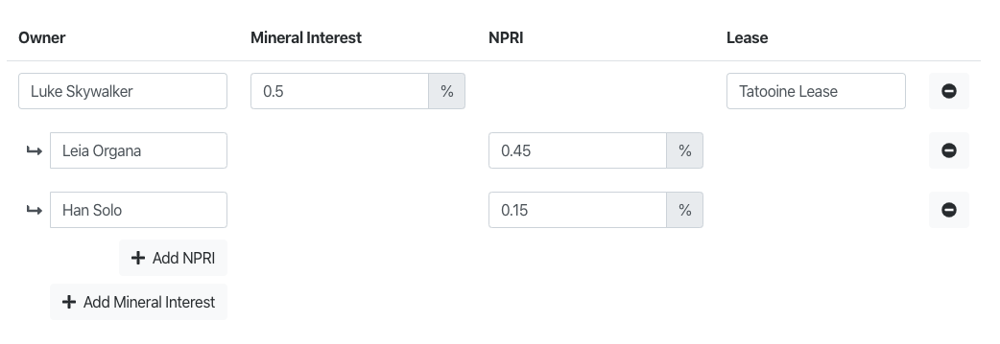
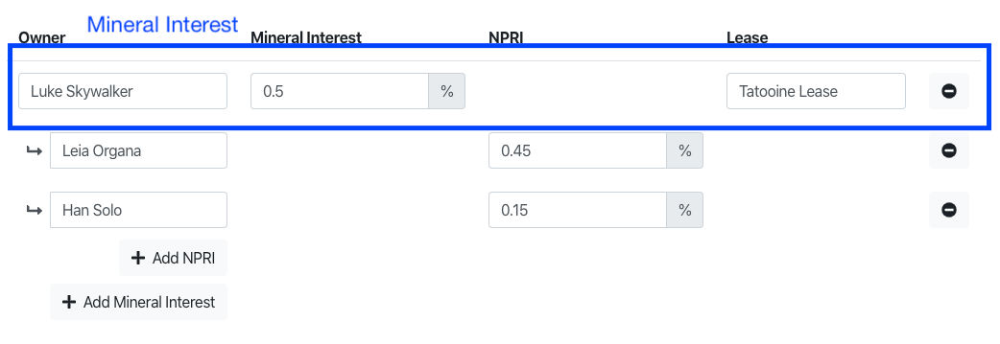
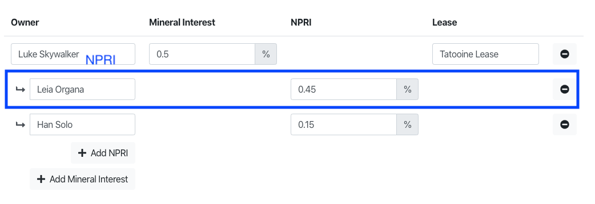

# Welcome to the Landdox Code Challenge :)

You have been invited to take the Landdox React Code Challenge. We are not worried about the completion of the challenge. We just want to see an example of your work and then talk about your code.

We expect you to spend around ~2 hours on the challenge. Feel free to spend more or less depending on your progress and your satisfaction with the results.

## First Steps

1. You should have received an email with your Landdox developer reviewer. Coordinate via email with them on the best time to review you project over a screen share. FYI there may be more than 1 Landdox employee joining the screen share.

2. Clone this Git repo. Do not fork it. We want to protect your work from prying eyes.

3. Create a new repo under your GitHub username. If you want to make it private, go ahead. You can then invite a Landdox developer as a collaborator. Keeping the repo public is also ok.

4. Follow the directions on: [https://github.com/gitname/react-gh-pages](https://github.com/gitname/react-gh-pages) and add the ability to deploy the React app as a GitHub page.

5. You are now ready to do the code challenge.

- If you do not have a GitHub account or wish to use BitBucket or GitLab, go right ahead.

## A bit about the app

* App was created using create-react-app.
* We installed react-bootstrap for styling.
* We added a git commit hook (using husky and lint-staged) that runs prettier for code formatting. If you have another linting solution, feel free to use that instead.
* You can run the test with `npm run test`.
* We added Font Awesome for icons and added an `Icon` component. You can use or make your own.

## Code Challenge

You will be coding a React component to handle the editing of tract ownerships. We already installed bootstrap for styling ([https://react-bootstrap.github.io/](https://react-bootstrap.github.io/)). We would rather see your React code vs CSS / design skills.

A tract can have many mineral interests.

A mineral interest can have many NPRIs

With this component you should be able to:

- Add a mineral interest
- Remove a mineral interest
- Add a NPRI to a mineral interest
- Remove a NPRI from a mineral interest
- Edit the owner, interest, and lease information on a mineral interest
- Edit the owner and interest on a NPRI
- Every time you do any of the above actions, the `onChange` prop should be fired

Any restrictions? Nope.

Want to use a class, go for it.

Want to use redux, go for it.

Want to use hooks, ... you guessed it. Go for it.

The only restriction is that the tests should pass. And even with the tests feel free to add or modify the tests.

You can execute the tests using `npm run test`

After you are done, don't forget to push your code up and deploy your GitHub page.

- If not on GitHub, then it is ok if you don't deploy. It would be nice if you found an alternative deployment solution. :)

# Good luck and have fun!